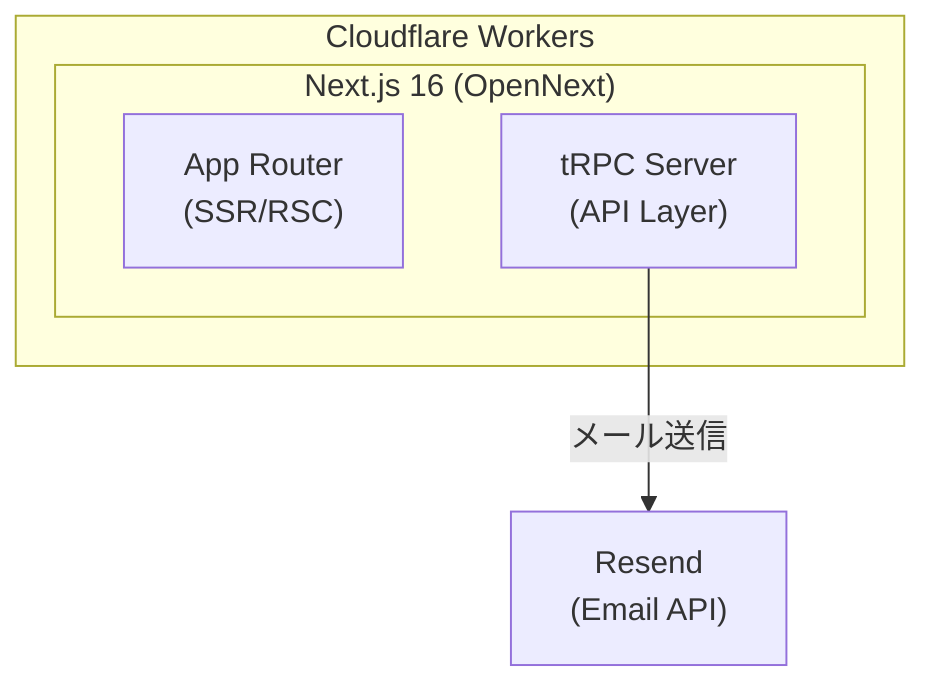
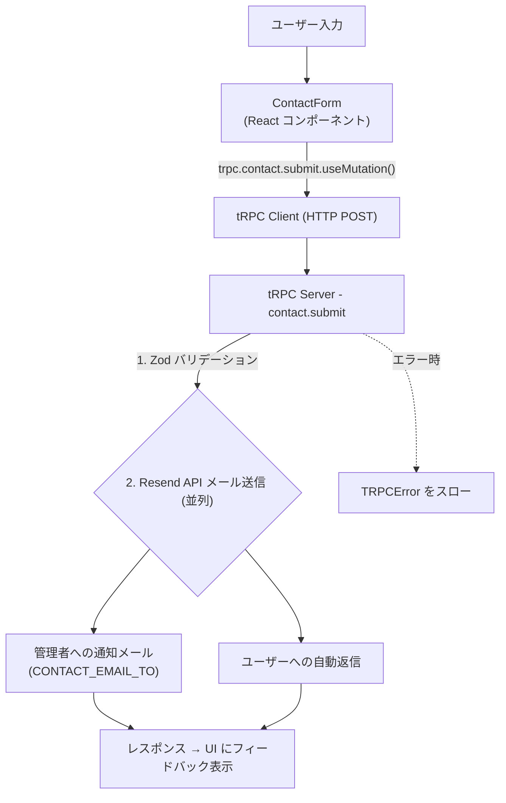
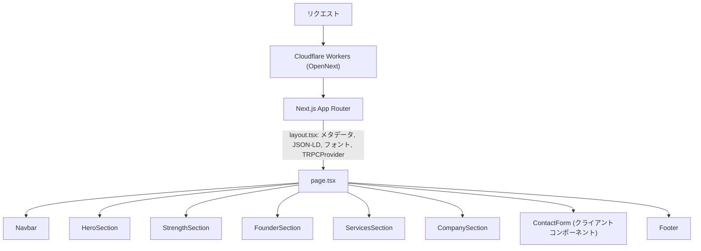
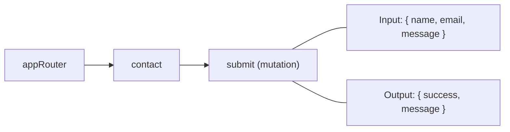

# アーキテクチャ

## 全体構成

- **フロントエンド**: Next.js App Router による SSR + クライアントサイドインタラクション
- **API**: tRPC でタイプセーフな API 通信
- **インフラ**: Cloudflare Workers 上で OpenNext を介して Next.js を実行
- **外部サービス**: Resend によるメール送信

## ディレクトリ設計

### `src/app/` - ルーティング & ページ

Next.js App Router のルーティング層。現状はシングルページ構成。

- `layout.tsx` - ルートレイアウト（メタデータ、JSON-LD、フォント、TRPCProvider）
- `page.tsx` - トップページ（各セクションコンポーネントを配置）
- `api/trpc/` - tRPC の HTTP エンドポイント

### `src/components/` - コンポーネント

4つのカテゴリに分類して管理している。

| ディレクトリ | 役割 | 例 |
|-------------|------|-----|
| `layout/` | サイト全体の構造を構成する共通レイアウト | `Navbar`, `Footer` |
| `sections/` | ページ内の各セクション。ビジネスロジックを含む | `HeroSection`, `ContactForm` |
| `providers/` | React コンテキストプロバイダー | `TRPCProvider` |
| `ui/` | shadcn/ui ベースの汎用 UI パーツ。ビジネスロジックなし | `Button`, `Input`, `Card` |

**コンポーネント配置ルール**:
- 再利用可能で汎用的なもの → `ui/`
- ページ固有のセクション → `sections/`
- サイト全体で使うレイアウト要素 → `layout/`
- 新しい UI コンポーネントの追加は `npx shadcn add <component>` を使用

### `src/lib/` - ユーティリティ & 設定

アプリケーション全体で使う共通ロジック・設定。

- `constants.ts` - サイトのデータ定義（ナビゲーション項目、サービス一覧、会社情報等）
- `utils.ts` - ユーティリティ関数（`cn()` for Tailwind クラス結合）
- `fonts.ts` - Google Fonts 設定（Outfit, Playfair Display, Noto Sans JP, Syncopate）
- `logger.ts` - Pino ロガーのインスタンス
- `trpc/client.ts` - tRPC React クライアント
- `email/resend.ts` - Resend クライアント（シングルトン）
- `email/templates.ts` - メールテンプレート（管理者通知、自動返信）

### `src/server/` - サーバーサイドロジック

tRPC サーバーの定義とルーター。

- `trpc/trpc.ts` - tRPC インスタンス（`router`, `publicProcedure` のエクスポート）
- `trpc/index.ts` - `appRouter` の定義と `AppRouter` 型のエクスポート
- `trpc/routers/contact.ts` - コンタクトフォーム API

## データフロー

### コンタクトフォーム送信

### ページレンダリング

## API 設計

### tRPC ルーター構成

- **publicProcedure** を使用（認証なし）
- バリデーションは Zod スキーマで入力時に実行
- エラーは `TRPCError` で適切な HTTP ステータスコードと共に返却

### 新しいルーターの追加方法

1. `src/server/trpc/routers/` に新しいルーターファイルを作成
2. `src/server/trpc/index.ts` の `appRouter` にルーターを追加
3. 型は `AppRouter` 経由で自動的にクライアント側に共有される

## 技術的判断

### Next.js on Cloudflare Workers

OpenNext を使用して Next.js を Cloudflare Workers 上で実行している。サーバーレスかつエッジでの配信により、低レイテンシーを実現。

### tRPC の採用

フロントエンドとバックエンドで型を共有し、API 通信のタイプセーフティを確保。現状は API エンドポイントが少ないが、拡張時にも一貫した方法で API を追加できる。

### shadcn/ui (Radix UI)

コンポーネントのソースコードを直接プロジェクトに持つことで、完全なカスタマイズ性を確保。`components.json` で設定を管理。

### Biome

ESLint + Prettier の代替として採用。単一ツールで lint を実行。formatter は無効化しており、lint のみ使用。
